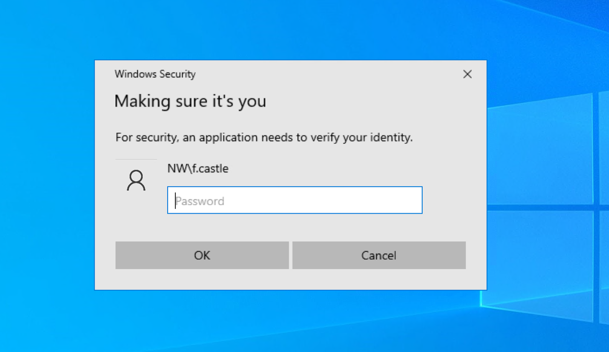

# SharpPrompt

## Intercepting Windows credentials by abusing Windows CredentialUI

This tool displays a Windows credential prompt to the user and sends the results back over HTTP/ or HTTPS

Once the user enters a password, it will be checked using LogonUserA. If the credentials are invalid, the invalid credentials error will be displayed to the user and they'll be prompted until they enter the correct password or until they close the exit the window. Upon a successful login, the creds will be sent back over http or https. You can set up a simple server to receive the results back or can simply just listen using netcat.

### Flags
#
`/host:` Host to send results back to | Required
#
`/text:` Changes the caption text displayed in the prompt. Default is 'Making sure it's you'
#
`/https` Specify to use https to send the credentials.
#
Note: the `/https` flag will use certificate validation. If you're using a self-signed cert, you can simply include https:// in the connection specifed in the `/host:` argument the creds will be sent over https while skipping certificate validation.
